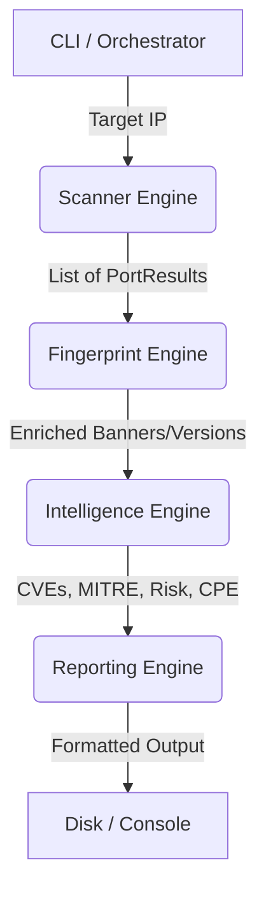
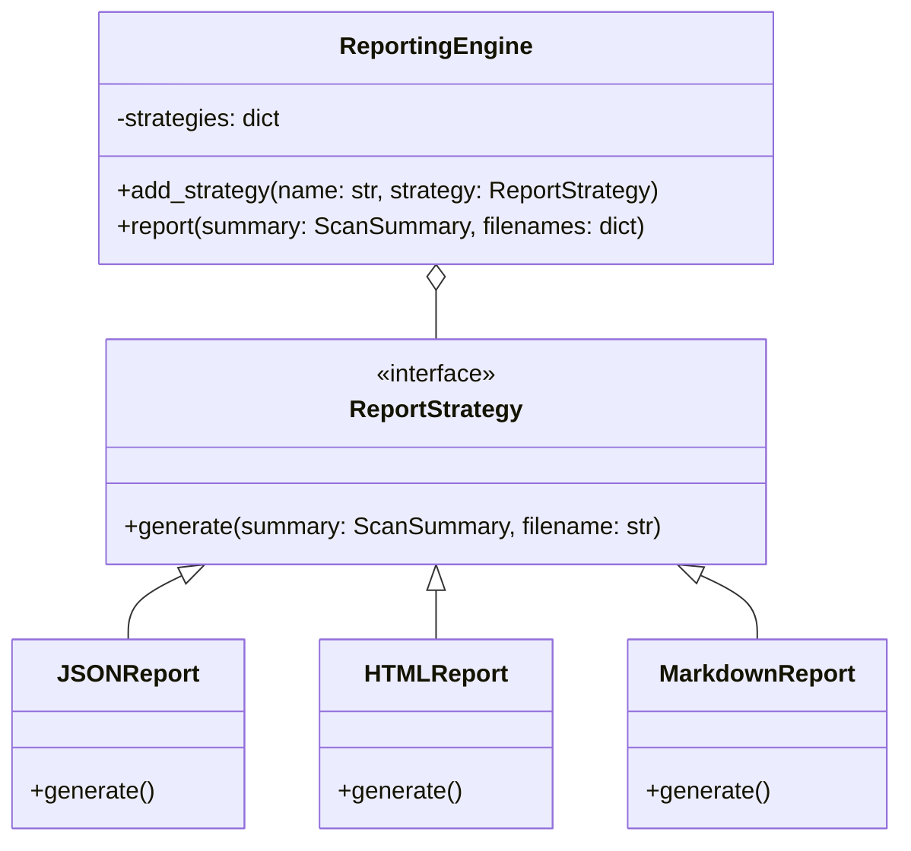
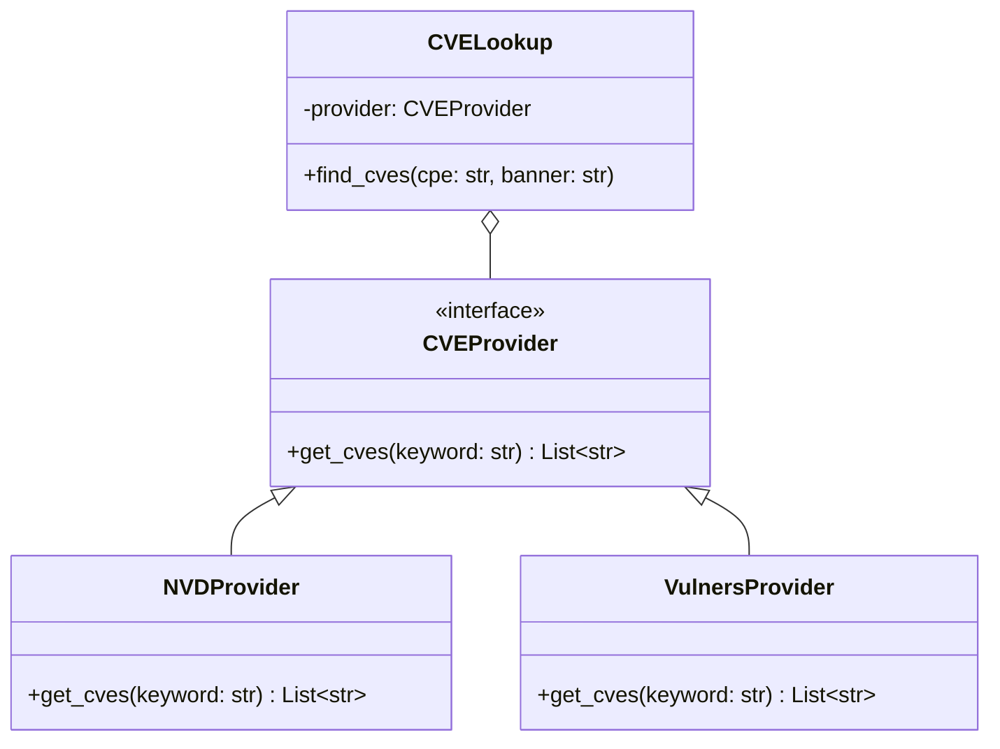
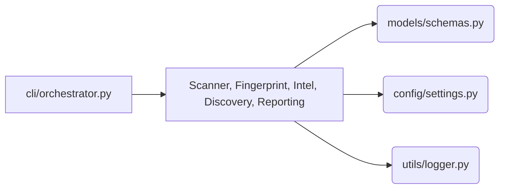
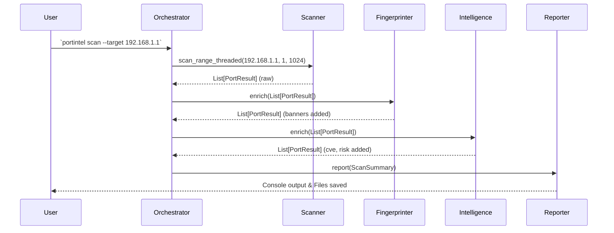

# 🏗️ PortIntel Architecture

This document describes the internal engineering, SOLID design principles, and module interaction pipeline of the PortIntel reconnaissance framework.

---

## 1. High-Level Data Flow Pipeline

The framework ensures that data flows in a strict, sequential pipeline. Each Engine is completely unaware of the other's implementation, communicating entirely via shared standard models (`PortResult`, `HostResult`, `ScanSummary`).

---

## 2. Engine Decoupling via Strategy Pattern

To prevent architectural decay, major modules utilize the **Strategy Pattern**. This allows developers to easily extend PortIntel without modifying core classes.

### Reporting Engine Strategy

### Intelligence Provider Strategy & Threat Enrichment
The Intelligence Engine orchestrates threat enrichment across four core subsystems:
1. **`CPEResolver`**: Uses an extensible service-to-CPE dictionary mapping strategy (`CPEMappingRule`) with word-boundary and regex banner matching and version normalization. Never fabricates CPEs when fingerprint evidence is insufficient.
2. **`CVEProvider` / `NVDProvider`**: The Intelligence Engine injects a `CVEProvider` into the `CVELookup` logic. `NVDProvider` queries the NIST NVD REST API 2.0, supporting optional `NVD_API_KEY` authentication from environment variables, bounded exponential backoff for HTTP 403/429 rate limits, and safe fallback to offline/empty results without throwing exceptions.
3. **`RiskScorer`**: Implements standards-based CVSS v3.1 base-score severity bands (`Critical`: 9.0+, `High`: 7.0+, `Medium`: 4.0+, `Low`: 0.1+, `None`: 0.0) while clearly separating **Vulnerability Severity** (`risk`) from **Service Exposure Concern** (`exposure_concern`, e.g. cleartext Telnet/FTP exposure).
4. **`MITREMapper`**: Automatically maps detected services and ports to MITRE ATT&CK enterprise tactics and techniques.

---

## 3. Package Relationships

PortIntel is strictly layered. Inner layers (Models, Config) cannot import from outer layers (CLI, Engines).

---

## 4. Execution Workflow

When a user initiates a scan, the `Orchestrator` governs the lifecycle.

