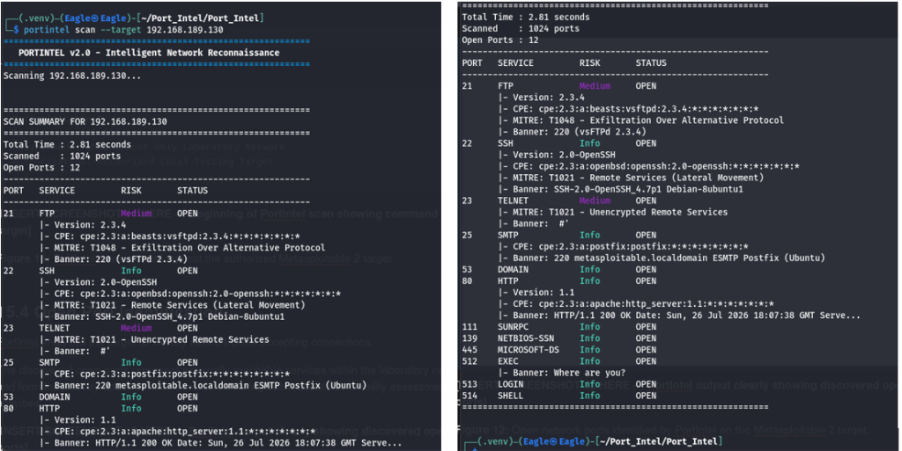
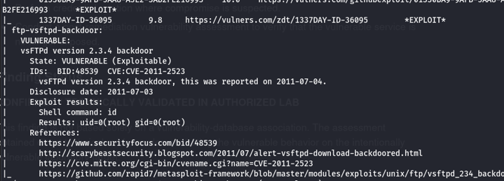

# PortIntel v2.0 — VAPT Laboratory Case Study

> An authorized vulnerability assessment demonstrating PortIntel v2.0 as the primary network reconnaissance and vulnerability-intelligence framework within an isolated Kali Linux and Metasploitable 2 laboratory.

---

## Table of Contents

1. [Overview](#1-overview)
2. [Scope & Authorization](#2-scope--authorization)
3. [Laboratory Architecture](#3-laboratory-architecture)
4. [Assessment Methodology](#4-assessment-methodology)
5. [PortIntel Reconnaissance](#5-portintel-reconnaissance)
6. [Service & Exposure Analysis](#6-service--exposure-analysis)
7. [Independent Validation](#7-independent-validation)
8. [Confirmed Finding — VAPT-001](#8-confirmed-finding--vapt-001)
9. [Remediation Recommendations](#9-remediation-recommendations)
10. [False-Positive Handling](#10-false-positive-handling)
11. [Key Lessons](#11-key-lessons)
12. [PortIntel's Role in the VAPT Workflow](#12-portintels-role-in-the-vapt-workflow)
13. [Full Assessment Report](#13-full-assessment-report)
14. [Ethical Use Statement](#14-ethical-use-statement)

---

## 1. Overview

PortIntel v2.0 was originally developed as an intelligent network reconnaissance framework, built on a modular intelligence pipeline — from host discovery and port enumeration, through service fingerprinting, CPE resolution, and NVD-backed vulnerability intelligence, to MITRE ATT&CK-aware exposure context and structured professional reporting.

This case study documents a practical Vulnerability Assessment and Penetration Testing (VAPT) workflow in which PortIntel v2.0 served as the **primary reconnaissance and vulnerability-intelligence tool**. The assessment was conducted in a fully isolated, authorized laboratory environment and demonstrates how PortIntel integrates into a broader, professional VAPT workflow.

**PortIntel's demonstrated pipeline in this assessment:**

```
PortIntel v2.0
    │
    ├── Host Discovery
    ├── Port Enumeration (TCP)
    ├── Service Fingerprinting
    ├── Banner Grabbing
    ├── Product / Version Identification (where available)
    ├── CPE Resolution
    ├── NVD Vulnerability Intelligence
    ├── MITRE ATT&CK Context
    ├── Risk / Exposure Classification
    │
    ▼
Independent Validation (Nmap / Nmap NSE)
    │
    ▼
Evidence Collection
    │
    ▼
Remediation Recommendations
```

> **Important:** PortIntel is a reconnaissance and intelligence framework. It is **not** an exploitation framework.

---

## 2. Scope & Authorization

| Attribute             | Detail                                      |
|-----------------------|---------------------------------------------|
| **Authorization**     | Authorized, educational laboratory          |
| **Network**           | VMware Host-Only (isolated, no internet exposure) |
| **Assessment Host**   | Kali Linux                                  |
| **Target System**     | Metasploitable 2                            |
| **Target IP**         | 192.168.189.130                             |
| **Public Systems**    | None — no public or third-party infrastructure targeted |
| **Scope Boundary**    | Strictly the isolated VMware Host-Only network |

**Explicit Scope Statements:**

- Testing occurred **only** in an isolated VMware Host-Only laboratory network.
- Metasploitable 2 is an intentionally vulnerable virtual machine designed for security training and education.
- **No public systems were targeted.**
- **No third-party infrastructure was assessed.**
- All testing was educational and conducted with full authorization within the isolated environment.

---

## 3. Laboratory Architecture

```
┌─────────────────────────────────┐
│        Assessment Workstation   │
│           Kali Linux            │
│   PortIntel v2.0  │  Nmap/NSE  │
└──────────────┬──────────────────┘
               │
         VMware Host-Only
            Network
               │
┌──────────────┴──────────────────┐
│         Target System           │
│       Metasploitable 2          │
│      IP: 192.168.189.130        │
└─────────────────────────────────┘
```

**Component Roles:**

| Component | Role |
|-----------|------|
| **Kali Linux** | Assessment workstation running PortIntel v2.0 and Nmap |
| **PortIntel v2.0** | Primary custom reconnaissance and vulnerability-intelligence framework |
| **Nmap / Nmap NSE** | Independent validation tool for service-version verification and vulnerability-specific testing |
| **VMware Host-Only Network** | Fully isolated private network — no internet routing, no external exposure |
| **Metasploitable 2** | Intentionally vulnerable target VM, designed for authorized security training |

---

## 4. Assessment Methodology

The assessment followed a structured, phased approach:

| Phase | Activity |
|-------|----------|
| **1** | Environment verification — confirm isolated network, validate target reachability |
| **2** | Host discovery — confirm target host availability |
| **3** | TCP port enumeration — systematic scan of the target's TCP attack surface |
| **4** | Service identification — map open ports to expected services |
| **5** | Banner / service fingerprinting — extract service banners and version strings |
| **6** | CPE resolution and vulnerability intelligence — automated CPE formulation and NVD CVE lookup where supported |
| **7** | Attack-surface analysis — evaluate the exposure profile of identified services |
| **8** | Independent Nmap validation — verify selected service/version findings independently |
| **9** | Vulnerability-specific validation — targeted Nmap NSE checks against candidate findings |
| **10** | Evidence collection — capture terminal output, banners, and NSE results |
| **11** | Risk classification — apply CVSS-aligned severity ratings to confirmed findings |
| **12** | Remediation recommendations — document actionable remediation steps |

---

## 5. PortIntel Reconnaissance

PortIntel v2.0 was used as the **primary reconnaissance tool** to enumerate the TCP attack surface of the Metasploitable 2 target.

### Scan Parameters

| Parameter | Value |
|-----------|-------|
| **Target** | 192.168.189.130 |
| **Protocol** | TCP |
| **Ports Scanned** | 1,024 |
| **Open Ports Identified** | 12 |
| **Scan Duration** | 2.81 seconds |

### Observed Open Ports

| Port | Service Label |
|------|---------------|
| 21   | FTP           |
| 22   | SSH           |
| 23   | TELNET        |
| 25   | SMTP          |
| 53   | DOMAIN (DNS)  |
| 80   | HTTP          |
| 111  | SUNRPC        |
| 139  | NETBIOS-SSN   |
| 445  | MICROSOFT-DS  |
| 512  | EXEC          |
| 513  | LOGIN         |
| 514  | SHELL         |

### Evidence



*PortIntel v2.0 identifying the exposed TCP attack surface of the authorized Metasploitable 2 target.*

> **Note:** An **open port is not automatically a vulnerability.** The presence of an open port indicates that a service is listening and reachable. Whether that service constitutes a security risk requires additional fingerprinting, version correlation, and — critically — evidence-backed validation.

---

## 6. Service & Exposure Analysis

PortIntel identified service banners and version information where available. The following summarizes significant observed services and their exposure context:

| Port | Service | Identified Version / Banner | Exposure Concern |
|------|---------|-----------------------------|------------------|
| 21   | FTP — vsFTPd | **2.3.4** (banner: `220 (vsFTPd 2.3.4)`) | **Critical** — see VAPT-001 |
| 22   | SSH — OpenSSH | **2.0-OpenSSH** (CPE: `cpe:2.3:a:openbsd:openssh`) | Medium — SSH version identified; lateral movement context (MITRE T1021) |
| 23   | Telnet | Banner: `#'` — version unresolved | Medium — unencrypted remote service (MITRE T1021) |
| 25   | SMTP — Postfix | Banner: `220 metasploitable.localdomain ESMTP Postfix (Ubuntu)` | Info — mail service, software version not individually resolved |
| 53   | DNS | Open; version not bannerized via TCP | Info — DNS service exposed |
| 80   | HTTP | Banner: `HTTP/1.1 200 OK` — Apache version **unknown/unresolved** | Info — web service; `HTTP/1.1` is the **protocol identifier**, not a software version |
| 111  | SUNRPC | Open | Info — RPC portmapper exposed |
| 139  | NETBIOS-SSN | Open | Info — NetBIOS session service |
| 445  | MICROSOFT-DS | Open | Info — SMB service; SMB exposure warrants further assessment |
| 512  | EXEC | Banner: `Where are you?` | Info — legacy RSH exec service; inherently insecure |
| 513  | LOGIN | Open | Info — legacy remote login service |
| 514  | SHELL | Open | Info — legacy remote shell service (rsh) |

### Clarification: HTTP Version vs. Software Version

PortIntel's banner grabber captured `HTTP/1.1 200 OK` on port 80. This is the **HTTP protocol version** returned in the response header — **not** an Apache software version of 1.1. The underlying web server software version was not reliably extracted from the banner; it is therefore recorded as **Unknown/Unresolved**. Accurate, evidence-based reporting requires this distinction.

---

## 7. Independent Validation

After PortIntel completed its reconnaissance sweep, **Nmap** was used to independently verify selected service and version findings and to perform targeted, vulnerability-specific validation.

**Why independent validation?**

- **Corroboration:** A single tool's findings should be independently verified before being escalated as confirmed.
- **Specialized checks:** Nmap NSE scripts provide targeted, vulnerability-specific tests (e.g., `ftp-vsftpd-backdoor`) that complement a general-purpose reconnaissance framework.
- **Confidence:** Independent verification from a different tool increases confidence in a finding prior to reporting.

**Important distinction maintained throughout this document:**

> PortIntel remained the **primary custom reconnaissance and vulnerability-intelligence tool**.
> Nmap was used as an **independent validation tool** for selected service/version findings and vulnerability-specific NSE checks.
> These roles are distinct and complementary — Nmap is not a replacement for PortIntel's intelligence pipeline.

---

## 8. Confirmed Finding — VAPT-001

---

### ⚠️ VAPT-001 — vsFTPd 2.3.4 Backdoor

| Attribute       | Detail                                         |
|-----------------|------------------------------------------------|
| **Port**        | TCP/21                                         |
| **Service**     | FTP                                            |
| **Product**     | vsFTPd                                         |
| **Version**     | 2.3.4                                          |
| **CVE**         | CVE-2011-2523                                  |
| **CVSS Score**  | 10.0 (Critical)                                |
| **Risk**        | Critical                                       |
| **Status**      | **Confirmed / Technically Validated in Authorized Lab** |

---

#### Description

vsFTPd version 2.3.4 is known to contain a deliberately introduced backdoor. When a specific sequence is sent during FTP authentication (a smiley face `:)` in the username field), the backdoor opens a command shell on **TCP/6200**. This backdoor was introduced into the vsFTPd 2.3.4 source archive on 2011-07-03 and subsequently reported as CVE-2011-2523.

#### How Each Tool Contributed

| Tool | Contribution |
|------|-------------|
| **PortIntel v2.0** | Identified the FTP service on TCP/21; fingerprinted the service banner (`220 (vsFTPd 2.3.4)`); resolved CPE `cpe:2.3:a:beasts:vsftpd:2.3.4:*:*:*:*:*:*:*`; flagged MITRE ATT&CK context T1048 (Exfiltration Over Alternative Protocol) |
| **Nmap** | Independently verified service version 2.3.4 |
| **Nmap NSE (`ftp-vsftpd-backdoor`)** | Performed targeted vulnerability-specific validation |

> **PortIntel identified and fingerprinted the exposed FTP service. Nmap independently verified the service/version. Nmap NSE performed the vulnerability-specific validation.**
>
> PortIntel **did not perform exploitation.** It is a reconnaissance and intelligence framework, not an exploitation framework.

#### Nmap NSE Validation Result

```
ftp-vsftpd-backdoor:
  VULNERABLE:
    vsFTPd version 2.3.4 backdoor
    State: VULNERABLE (Exploitable)
    IDs: BID:48539  CVE:CVE-2011-2523
      vsFTPd version 2.3.4 backdoor, this was reported on 2011-07-04.
    Disclosure date: 2011-07-03
    Exploit results:
      Shell command: id
      Results: uid=0(root) gid=0(root)
```

#### Evidence



*Independent vulnerability-specific validation of CVE-2011-2523 in the isolated laboratory.*

---

## 9. Remediation Recommendations

The following remediation steps are recommended based on the findings of this authorized assessment. **Remediation was not performed as part of this case study** — these are recommendations only.

| Priority | Recommendation |
|----------|---------------|
| **Critical** | Remove vsFTPd 2.3.4 immediately — replace with a current, supported version from a trusted source |
| **High** | Disable FTP service entirely where it is not operationally required |
| **High** | Prefer secure file-transfer mechanisms such as **SFTP** (SSH-based) over plaintext FTP |
| **High** | Disable Telnet (port 23) — replace with SSH for encrypted remote management |
| **High** | Disable or restrict legacy remote services (EXEC/512, LOGIN/513, SHELL/514 — the r-services) |
| **Medium** | Apply network segmentation and firewall controls to restrict access to exposed services by source IP and role |
| **Medium** | Replace obsolete or unsupported packages with current, actively maintained alternatives |
| **Medium** | Evaluate SMB exposure (ports 139/445) — apply appropriate access controls |
| **Low** | Restrict SUNRPC (port 111) exposure — disable if not required |
| **Ongoing** | Reassess the system's attack surface after applying remediation to confirm closure of identified exposures |

---

## 10. False-Positive Handling

Professional VAPT methodology requires that **automated candidate findings are validated at the specific endpoint level** before being reported as confirmed vulnerabilities.

### Example: Mutillidae — SQL Injection Candidate

During the assessment, automated scanning indicated potential SQL injection locations within the Mutillidae web application hosted on the target.

**Controlled validation attempt:**

A manual login test was performed at the identified endpoint:

| Field | Value Used |
|-------|------------|
| **Username** | `' OR '1'='1' --` |
| **Password** | `test` |

**Result:** No observable authentication bypass occurred at the tested login endpoint.

**Conclusion:**

| Attribute | Value |
|-----------|-------|
| **Finding** | SQL Injection — Mutillidae login endpoint |
| **Status** | **NOT CONFIRMED** for the tested endpoint |

> **Important:** This does not mean the application is free of SQL injection vulnerabilities. It means the specific payload used at the specific tested endpoint did not produce an observable bypass. Additional endpoints, injection points, and payloads would require separate, targeted assessment.

This result demonstrates a core professional principle: **automated candidate findings must be individually validated before escalation**.

---

## 11. Key Lessons

This assessment reinforces several foundational principles of professional security assessment:

| Principle | Explanation |
|-----------|-------------|
| **Open port ≠ vulnerability** | A listening port indicates a service is reachable; it does not confirm a security weakness |
| **Version correlation ≠ confirmed vulnerability** | Identifying a version that appears in a CVE database does not confirm exploitability — the binary, configuration, and patching state must be considered |
| **Scanner result ≠ confirmed exploitability** | Automated tools surface candidates; professional VAPT requires evidence-backed validation |
| **Evidence and validation matter** | VAPT-001 was classified as confirmed only after Nmap NSE independently returned a verifiable exploit result |
| **Independent verification improves confidence** | Using a second, independent tool (Nmap) to validate PortIntel's reconnaissance findings increased reporting confidence |
| **Negative validation should be documented** | The SQL injection NOT CONFIRMED result is a professionally important outcome — it is not a failure, it is accurate reporting |
| **Accurate reporting > inflated counts** | One well-evidenced confirmed finding with proper documentation is more professionally valuable than ten unsupported candidate findings |

---

## 12. PortIntel's Role in the VAPT Workflow

PortIntel v2.0 is a **network reconnaissance and vulnerability-intelligence framework**. This case study positions PortIntel accurately within the broader VAPT workflow.

### What PortIntel Demonstrated

| Capability | Demonstrated |
|------------|-------------|
| Host Discovery | ✅ |
| TCP Port Enumeration | ✅ |
| Service Identification | ✅ |
| Banner Grabbing | ✅ |
| Service Fingerprinting | ✅ |
| Product / Version Identification | ✅ (where banner data supported it) |
| CPE Resolution | ✅ (`cpe:2.3:a:beasts:vsftpd:2.3.4:*:*:*:*:*:*:*`) |
| NVD Vulnerability Intelligence | ✅ |
| Risk / Exposure Contextualization | ✅ |
| MITRE ATT&CK Mapping | ✅ (T1048, T1021) |
| Structured Reconnaissance Output | ✅ |

### What PortIntel Is NOT

| Claim | Accurate |
|-------|---------|
| PortIntel is an exploitation framework | ❌ — No |
| PortIntel is a Metasploit replacement | ❌ — No |
| PortIntel is a Burp Suite replacement | ❌ — No |
| PortIntel is an Nmap replacement | ❌ — No |

### Where PortIntel Fits

```
Reconnaissance Phase ──► PortIntel v2.0 (primary)
                               │
              ┌────────────────┴────────────────┐
              │                                 │
    Service Intel & CVE                   Exposure Context
    (CPE → NVD → CVSS)              (MITRE ATT&CK mapping)
              │
              ▼
    Independent Validation ──► Nmap / Nmap NSE
              │
              ▼
    Reporting & Recommendations
```

The value of this case study is demonstrating **how PortIntel integrates into and accelerates the reconnaissance-through-intelligence phases** of a professional VAPT workflow — not as a standalone exploitation platform, but as the intelligent foundation on which a professional security assessment is built.

---

## 13. Full Assessment Report

For the complete detailed findings, methodology notes, service enumeration tables, CPE resolution outputs, CVE intelligence data, and evidence documentation:

**[📄 Read the Full VAPT Assessment Report](./PortIntel_VAPT_Final_Report.pdf)**

---

## 14. Ethical Use Statement

> This case study was conducted exclusively in an **isolated, authorized cybersecurity laboratory** using **Metasploitable 2** — an intentionally vulnerable virtual machine designed for security education.
>
> PortIntel is intended for **authorized security assessment, education, research, and defensive security use** only. Users of PortIntel are responsible for ensuring they have explicit authorization before scanning any system. Never test systems without written, explicit consent from the system owner.
>
> **No public, production, or third-party systems were targeted at any point during this assessment.**

---

<p align="center">
  <i>PortIntel v2.0 — Intelligent Network Reconnaissance &nbsp;|&nbsp; Authorized Laboratory Assessment</i><br>
  <i>Developed by <a href="https://github.com/kharbashpriyanshu">Priyanshu Kharbash</a></i>
</p>
